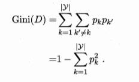
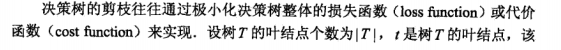
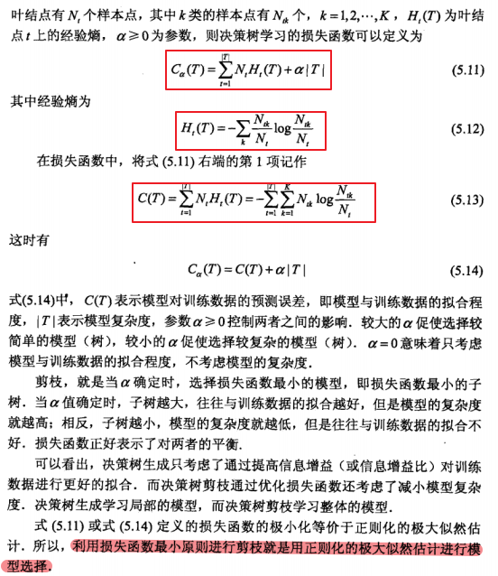
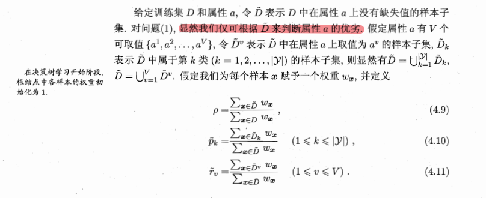
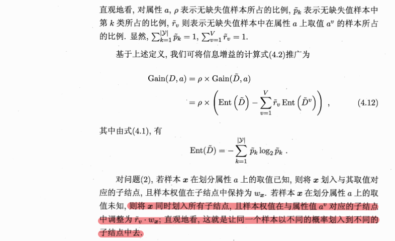
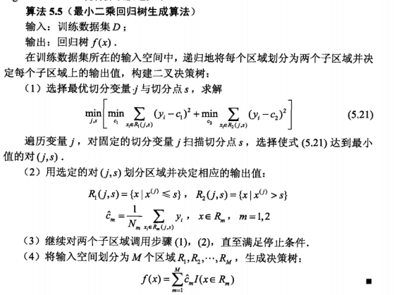
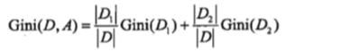
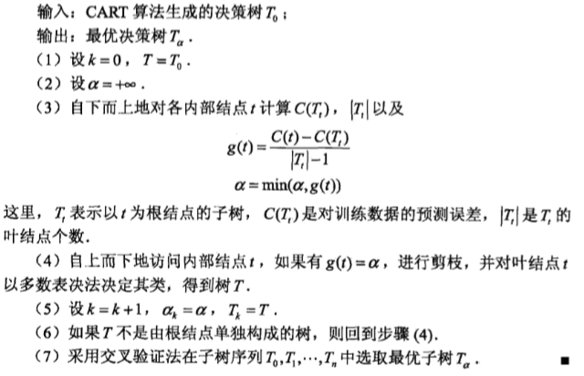

## 决策树和分类回归树CART
@(面试准备/整理)

### 决策树
#### 算法目标
学习出一个与训练数据矛盾较小的决策树，同时具有很好的泛化能力(周志华)
决策树的学习目标是"以损失函数为目标函数的最小化"（李航）

#### 算法

#### 特征选择
特征选择是决策树的关键一步。特征选择决定通过哪个特征来划分特征空间。
随着划分进行，我们希望决策树的分支节点包含的样本尽可能属于同一类别，结点的“纯度”越来越高。
一些概念：
- 熵（信息熵）：表示随机变量不确定性的度量，熵越大，变量的不确定性越大
   假定当前样本$D$中第$k$类样本所占比例为$p_k(k=1,2,...,|\gamma|)$，信息熵为:
  $$ Ent(D) = \sum_{k=0}^{|\gamma|}p_klog_2p_k \ $$
- 条件熵：表示在已知特征$a$的条件下对随机变量$Y$的不确定性的度量
  假设离散属性$a$有V个可能的取值${a^1,a^2...a^v}$,$D^V$表示属性a上取值为$a^v$的样本，条件熵为：
  $$ Ent(D，a) = \sum_{v=0}^{V}\frac{D^v}{D} Ent(D^v) $$
- 信息增益（互信息）
  $$ Gain(D，a) =Ent(D)- Ent(D，a)$$
- 增益率：
  $$ Gain_ratio(D，a) =\frac{Gain(D，a)}{IV(a)}$$
  其中，$IV(a) = - \sum_{v=1}^{V}\frac{D^v}{D}log_2\frac{D^v}{D}$
- 基尼系数
  

#### 决策树算法
- ID3：采用信息增益来划分属性
- C4.5：采用增益率来划分属性
- CART 决策树：采用基尼系数来选择划分属性

#### 减枝：防止过拟合
减枝通过极小化决策树整体的损失函数来实现（李航）。
统计学习方法通过定义决策树的损失函数，若对某个节点减枝后决策树的损失函数小于未减枝前的损失函数，则进行减枝。

在周志华书中介绍了预减枝和后减枝。采用留一法进行验证。若验证集精度表明减值后比减枝前好，则进行减枝。
- 预减枝：基于贪心本质，降低时间开销，但是可能带来欠拟合风险。
- 后减枝：训练时间长

#### 连续值处理
对属性a的值进行排序，对相邻的值取中位数，然后像离散值一样，遍历每个中位数来取得最好的划分属性。
#### 缺失值处理
- 如何在属性值缺失的情况下进行划分属性选择？
- 给定划分属性，若样本在该属性上的值缺失，如何对样本进行划分？
  
  

### 分类回归树CART
分类回归树，是二叉树，可以用于分类也可以用于回归。
CART算法有两步：
- 决策树生成
- 决策树剪枝
#### 特征选择方法
特征选择方法：
- 分类：基尼系数
- 回归：最小二乘偏差（LSD）或最小绝对偏差（LAD）

#### 回归树的生成

即：
1. 考虑数据集D上的所有特征 j，遍历每一个特征下所有可能的取值或者切分点 s，将数据集 D 划分成两部分 D1 和 D2
2. 分别计算上述两个子集的平方误差和，选择最小的平方误差对应的特征与分割点，生成两个子节点。
3. 对上述两个子节点递归调用步骤(1)(2),直到满足停止条件。

#### 分类树的生成
1. 对每个特征 A，对它的所有可能取值 a，将数据集分为 A＝a，和 A!＝a 两个子集，计算集合 D 的基尼指数：
   
2. 遍历所有的特征 A，计算其所有可能取值 a 的基尼指数，选择 D 的基尼指数最小值对应的特征及切分点作为最优的划分，将数据分为两个子集。
3. 对上述两个子节点递归调用步骤(1)(2), 直到满足停止条件。
4. 生成 CART 决策树。

#### 算法的停止条件
1. 节点中的样本个数小于预定阈值，
2. 样本集的Gini系数小于预定阈值（此时样本基本属于同一类），
3. 或没有更多特征。

#### CART减枝对于一个完全生成的CART树

从整个树 T0 开始，先剪去一棵alpha最小的子树，生成子树 T1，在 T1 上再剪去一棵子树，生成子树 T2。
重复这个操作，直到最后只剩下一个根节点的子树 Tn，得到了子树序列 T0～Tn。
利用独立的验证数据集，计算每个子树的平方误差或者基尼指数。
选择误差最小的那个子树作为最优的剪枝后的树。

参考资料：
1. 统计学习方法
2. 机器学习
3. [CART剪枝详解](http://blog.csdn.net/wjc1182511338/article/details/76793164)
4. [CART 分类与回归树](https://www.jianshu.com/p/b90a9ce05b28)